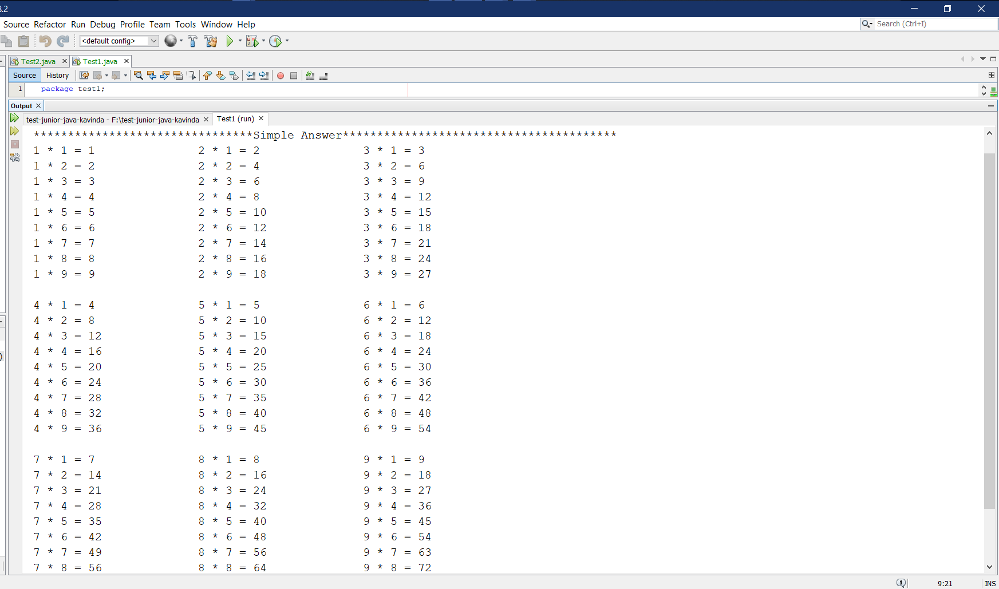
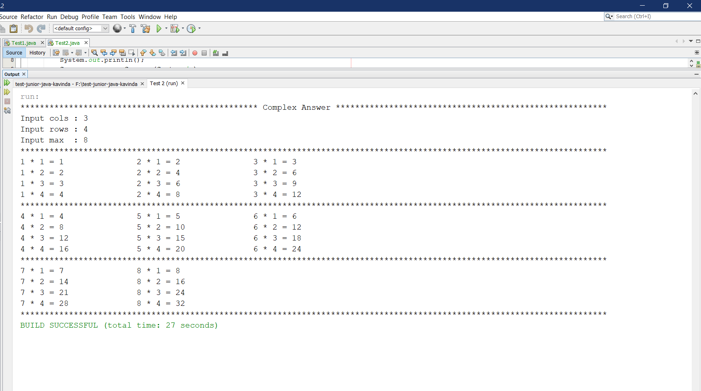

#  COMPLETE (Technical Test Explanation for Junior Java Developer)  #


### Test 1 ###

* Create two variables 
*cols - no of columns 
*max  - maximum multiplication table no
```
int max  = 9;
int cols = 3;
```

* Calculate how many main rows will be printed. 
* If remain of (max % cols)> 0 then add 1 row otherwise don't add a row.
```
 int mainRows = max / cols + (max % cols > 0 ? 1 : 0);
```

* Nested for loops for print multiplication table for each number(from 1 times to 9 times multiplication tables)
* Return minimum number of two numbers(Math.min() compare max and (iter+1)*columns)
* If iter*cols <= Math.min(value) then print the multiplication


```
for (int i = 1; i <= 9; i++) {
     for (int j = iter * cols + 1; j <= Math.min(max, (iter + 1) * cols); j++) {
          System.out.print(j + " * " + i + " = "  +(i * j) + "\t\t");
           }
      System.out.println();
            }
``` 

* Iterate through for loops until the conditions are through and print values.

  


### Test 2 ###

* Create three variables for get user inputs for no.of columns,rows and maximum multiplication table no
* Get user inputs
```
   System.out.print("Input cols : ");
     int cols = sc.nextInt();
                
   System.out.print("Input rows : ");
      int rows = sc.nextInt();
        
   System.out.print("Input max  : ");
      int max = sc.nextInt();
```

* Calculate how many main rows will be printed. 
* If remain of (max % cols)> 0 then add 1 row otherwise don't add a row.
```
 int mainRows = max / cols + (max % cols > 0 ? 1 : 0);
```
* Nested for loops for print multiplication table for each number(from 1 times to 9 times multiplication tables)
* Return minimum number of two numbers(Math.min() compare max and (iter+1)*columns)
* If iter*cols <= Math.min(value) then print the multiplication

```
   for (int i = 1; i <= rows; i++) {
        for (int j = iter * cols + 1; j <= Math.min(max, (iter + 1) * cols); j++) {
             System.out.print(j + " * " + i + " = "  +(i * j) + "\t\t");
                }
             System.out.println();
            }
```
* Iterate through for loops until the conditions are through and print values.

  


