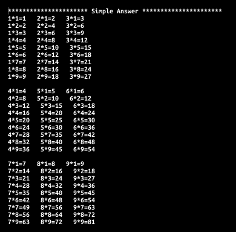
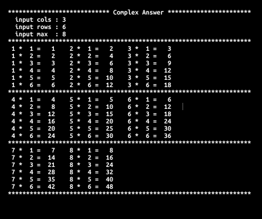

# ** README (Technical Testing Guide for Junior Java Developer) ** #

Please follow this document and finish the test within 1 day from the time you received this document.
In this test we are looking for more than just the functional results, we are also looking at your capabilities and practices as a developer.
At the same time, we also see your abilities to use our tools, how you communicate and work remotely online.

* You will get an invite to the source repository. Once you get the invite to sign up to get access. (If you have an account then just login)
* You will use git for checking out and submitting your task
* Follow the steps below
* Any technical question please create in the 'Issues'
* Use 'Coventional Commits' for your commit message. You can refer it from : https://www.conventionalcommits.org/en/v1.0.0/

---

## Step 1 : Clone the project from GitLab ##

Note: You must have your own GitLab account.

Clone the project from GitLab and create a new branch from 'master' as 'test'. We will see your git skills from this step.

## Step 2 : Write the code based on requirements below with Java ##

### Test 1 ### 

Print the `Multiplication table` same as the picture below.

### Test 2 ###

Get 3 parameters(cols, rows, max) and print the `Multiplication table` same as the picture below.

## Step 3 : Write 'COMPLETE.md' ##

Write 'COMPLETE.md' with the explaination of your source code and screenshots. Please put the screenshot files`(e.g. test1_result.png)` to '_markdown_'. We will check your markdown skills from this step.

## Step 4 : Test Submission ##

Once done, commit all your code in the GitLab repository, create a Merge Request from 'test' to 'master' and then share the link(URL) of the Merge Request via email.

Note: There should be two(master, test) branch in the repository.